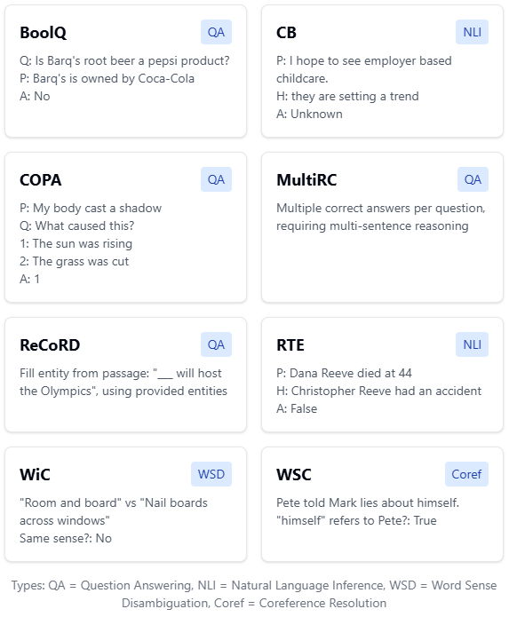
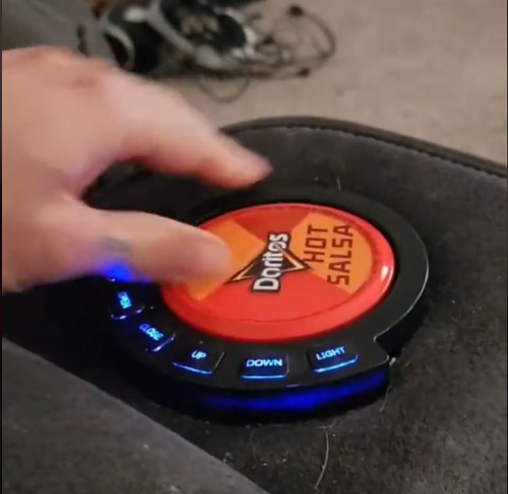

Recently, DeepSeek announced their latest model, R1, and article after article came out praising its performance relative to cost, and how the release of such open-source models could genuinely change the course of LLMs forever. That is really exciting! And also, too big of a scope to write about... but when a model like DeepSeek comes out of nowhere with a steel chair, boasting similar performance levels to other models, what does **performance** really mean in this context?

If you follow AI releases, you've seen this dance before. Every new model drops with its graphs showing how it's somehow simultaneously better than GPT-4 on math problems while being smaller and more efficient. But what exactly are these benchmarks measuring? How are they created? And more importantly, how can we cut through the hype to create our own benchmarks for specific use cases?

I wanted to learn more about **LLM Benchmarking**.
# Part 1: What is a Benchmark? (in 3 seconds)

**TL:DR** - The SATs (multiple, actually) for LLMs. 
# Part 1.1: What is a Benchmark? (in more than 3 seconds)

Before we dive into the nitty-gritty of specific benchmarks, let’s take a moment to unpack what we even mean by “LLM Benchmark.” Because calling them the “SATs for AI” feels both right and also slightly oversimplified.

LLM benchmarks are, at their core, **structured tests** used to measure how well large language models perform on certain tasks. These tasks can be anything from identifying if a statement is true or false, to summarizing a legal document, to generating valid Python functions. Think of them as curated obstacle courses specially designed by AI researchers to test every relevant muscle these models might have. These frameworks typically provide a dataset of inputs with known correct outputs, allowing for consistent comparison between models.

Modern benchmarks employ various evaluation methodologies. Classification metrics like **accuracy** work for tasks with discrete correct answers, while **overlap-based metrics** (BLEU, ROUGE) evaluate free-form text generation. Some benchmarks use functional testing for code generation, or employ other LLMs as judges to evaluate response quality.

A typical benchmark usually comes packaged as:
- **A standardized dataset** of questions, prompts, or tasks (with correct or reference answers).
- **An evaluation protocol** specifying how to measure success, like accuracy, F1 score, BLEU/ROUGE for text generation, or pass/fail rates for coding tasks.
- **A leaderboard** or some form of comparative scoreboard, often with big flashy graphs.

Some really famous benchmarks include **MMLU** for testing multitask language understanding, **TruthfulQA** for assessing factual accuracy, and **HumanEval** for measuring coding capabilities. Results are pretty often published on public leaderboards, which let's people perform some transparent comparison between different models.
### What Makes a _Good_ Benchmark?

1. **A Clear Task Definition:** We want tasks that are unambiguous. The more straightforward and well-specified the challenge, the easier it is to trust the results.
2. **Data Integrity:** The test set shouldn’t be floating around in the training data. Because if the model’s seen the exact same question 50 times before, the evaluation is about as useful as giving a math quiz to someone who already has the answer key.
3. **Quantifiable Metrics:** You need a standard for scoring performance—like how many times the model’s code passes test cases or how close the generated summary is to a “ground-truth” summary.
4. **Task Diversity & Difficulty:** If a benchmark is too easy, everyone just ACES it on day one, and we learn… well, nothing. If it’s too niche (like “We test only the model’s ability to count the digits of Pi for 20 minutes”), that’s also not so helpful.
### Life Ain't All about The Grades

Benchmarks capture only a slice of what LLMs can do. In the real world, your chatbot might need to juggle domain knowledge, keep track of conversation context, abide by your company’s policies, _and_ produce fluent, non-offensive replies. No single standardized test out there fully covers that. As we’ll see in the upcoming case studies, the design and _execution_ of a benchmark can heavily shape the picture you get of your model’s performance... and sometimes lead you astray if you’re not careful with how you measure success.

Now that we have a sense of what LLM benchmarks are designed to accomplish (and where they might fall short), let’s explore a couple of examples to see how people actually build and use them in practice - with mixed results!
## Case Study #1: Leetcode as an LLM Benchmark

The paper "Performance Study of LLM-Generated Code on Leetcode" asks a deceptively simple question: can we use Leetcode to benchmark LLM code generation? Their findings reveal both the promise and pitfalls of this approach.
### The Benchmark Design

The researchers built a three-stage validation system. Local tests catch basic errors, Leetcode's judge verifies correctness, and a custom benchmarking setup measures performance. This setup revealed something critical: benchmarking code performance is harder than it looks.

When they compared local measurements to Leetcode's metrics, they found only a 0.28 correlation. Leetcode's measurements showed much higher variation (0.089 vs 0.035 locally). Even worse, Leetcode's rankings proved unstable - identical solutions could drop from the 77th to 54th percentile just based on submission timing.


### The Real Problems

Three major issues emerged that challenge Leetcode's viability as a benchmark:

**Data Contamination**: Using public problems risks LLMs having seen the solutions during training. The researchers had to use only problems from 2023 to mitigate this.
**Platform Instability**: Leetcode's metrics drift over time - memory measurements showed a -0.24 correlation with test date. This makes reproducible benchmarking nearly impossible.
**Measurement Reliability:** The weak correlation between local and platform measurements raises questions about what we're actually testing.
### What It Means for LLM Benchmarking

This study doesn't just critique Leetcode - it highlights what we need in a code generation benchmark: reproducible measurements, reliable performance metrics, and guaranteed training-test separation. Until we have platforms built specifically for this purpose, we need to be extremely cautious about using competition platforms as benchmarks.

## Case Study #2: SuperGLUE - Building a Better Language Understanding Benchmark 

The SuperGLUE paper tackles a fascinating problem in AI benchmarking: what do you do when models get too good at your tests? When GLUE became insufficient (with models surpassing human performance), the researchers had to rethink how we measure language understanding.

### The Benchmark Design

SuperGLUE's core innovation is its task selection methodology. The researchers collected task proposals from the NLP community and filtered them through a rigorous process: each task needed clear evaluation metrics, public training data, and - most importantly - significant headroom between machine and human performance.

This resulted in eight tasks (I've simplified the table from the document here, it's a little less readable but you should get the sense of what the questions are asking):



What makes these tasks special is their diversity in format. Unlike GLUE's focus on sentence classification, SuperGLUE includes coreference resolution, reading comprehension, and more com plex reasoning tasks. Each task measures different aspects of language understanding while maintaining clear, quantifiable metrics.

# Part 2: Let's Build a Physical Reasoning Benchmark: To Cheat at Escape Rooms

After looking at some benchmarks like SuperGLUE and Leetcode, I had an idea: what if we tested LLMs on something completely different - physical reasoning... through escape room puzzles?

It's a pretty valid idea - escape rooms poses possibilities and consequences for failure - screw up one too many puzzles, and your friends will think you're pretty stupid, and relegate you to spectator duty. Luckily for us however, they (or the poor employees) don't know that you can sneak a phone into an escape room - and you know just who to ask for the answers. Today, LLMs face off against the puzzles of a physical escape room.

**Note:** This is **NOT** a rigorous academic benchmark (please don't cite this in papers, why would you even want to do that?), or even close to it, and it's just supposed to be a fun way to test LLM benchmarking and evaluation. Please do not destroy my prompts, I am aware they are bad.
## Why Physical Reasoning?

For real, though... most LLM benchmarks focus on linguistic tasks (like SuperGLUE) or code generation (like Leetcode). And for good reason - these are well-defined domains with clear evaluation metrics. But real-world problem solving often requires understanding physical principles and their interactions. The famous "Can GPT-4 do physics?" debates usually center around mathematical problem-solving, not practical physical reasoning.

Looking at existing benchmarks taught me a few key principles:
1. **Clear evaluation** metrics are crucial (from SuperGLUE's task-specific scores)
2. **Problems** should have unambiguous solutions (from HumanEval's test cases)
3. The benchmark should test **distinct capabilities** (from MMLU's subject categories)

## Designing the Problems

I settled on escape room puzzles for two reasons. First, they naturally combine physical reasoning with clear goals. Second, they have unambiguous success conditions - either you solve it through the intended way, or you don't. Third, and most importantly, they let me include "red herrings" - irrelevant items that test if the LLM can identify what matters physically. Fourth, I just really like doing escape rooms (did I mention that already?),

I am aware that this is more than two reasons, but if LLMs can't count how many rs' there are in strawberry, I'm allowed to mess up once in a while too.

Here's how I structured the five core problems:

**Fluid Dynamics (FLUID_001)**
   - Tests understanding of buoyancy and fluid displacement
   - Inspired by classic physics problems but in practical context
   - Includes intentionally irrelevant items (like squishy food models)

**Light Properties (UV_001)**
   - Tests understanding of UV fluorescence and material properties
   - Combines multiple physical principles (light, material science)
   - Requires understanding of environmental conditions

**Mechanical Understanding (CIPHER_001)**
   - Tests spatial reasoning and mechanical alignment
   - No red herrings - tests for correlating a dial to a cypher wheel
   - Requires understanding rotational symmetry

**Force Application (VAC_001)**
   - Tests understanding of vacuum forces and surface adhesion
   - Multiple possible solution approaches
   - Requires understanding force multiplication

**Collaborative Physics (COLLAB_001)**
   - Tests understanding of physical constraints in multi-agent scenarios
   - Requires combining multiple physical principles
   - Tests understanding of tool creation and friction

Sounds really fancy... but it's just some basic physical puzzles. You can access them on my github.
## The Technical Part

The benchmark implementation has three main components:
### Problem Definition Layer

Problems are defined in a structured JSON format that enforces consistent evaluation:

```json
{
    "problem_id": "FLUID_001",
    "setup": {
        "scenario": "A ping pong ball is at the bottom of a narrow tube...",
        "available_items": ["bottle of water", "squishy food models"...],
        "constraints": ["tube too narrow for manual retrieval"]
    },
    "physical_principles": ["buoyancy", "fluid displacement"],
    "red_herrings": ["squishy food models", "milk carton"],
    "solution": {
        "steps": ["pour water into tube", "allow ball to float"],
        "key_insights": ["water displaces air", "ping pong ball less dense"]
    }
}
```

This structure draws from SuperGLUE's design - each component is clearly separated and machine-readable. The `physical_principles` field explicitly lists what's being tested, while `red_herrings` helps in scoring the LLM's ability to ignore irrelevant information.
### 2. Evaluation Framework

The evaluation system uses Python's asyncio for concurrent testing, with retry logic for a little bit more API stability:

```python
@retry(stop=stop_after_attempt(3), wait=wait_exponential(min=1, max=10))
async def evaluate_response(self, criteria: JudgingCriteria) -> Dict:
    """Evaluate a model's response using GPT-4 as judge."""
    async with aiohttp.ClientSession() as session:
        # ... evaluation logic
```

The scoring system looks at three components:

**Physical Understanding Score (PUS)** ∈ [0,2]
   - Measures understanding of relevant physical principles
   - Calculated as normalized sum of demonstrated principles

**Solution Path Score (SPS)** ∈ [0,2]
   - Evaluates completeness and correctness of solution steps
   - Considers practical feasibility of proposed solutions

**Red Herring Handling (RHH)** ∈ {0,1}
   - A Binary score for avoiding irrelevant items
   - Tests ability to focus on physically relevant factors

And yes, there are also so many other scoring methods, better and worse, that could be used! For example, RHH could be about how **many** irrelevant items are used in the solution, or it could be a measure of how viable the use is... the point is that picking these metrics are often times pretty arbitrary, but are very very important to making your benchmark is credible, which mine is very much not. 

Additionally, I did not want to rewrite any code after. Sue me.
### 3. Model Interface Layer

The benchmark supports multiple LLM backends through a common interface:

```python
class ModelInterface:
    """Interface for different LLM APIs."""
    async def generate_response(self, prompt: str) -> str:
        raise NotImplementedError

class GPT4Interface(ModelInterface):
    async def generate_response(self, prompt: str) -> str:
        # GPT-4 specific implementation

class ClaudeInterface(ModelInterface):
    async def generate_response(self, prompt: str) -> str:
        # Claude specific implementation
```

*two models... I can't really afford any more, please understand*

## Let's Test It!

So after some refilling of API balances, I was ready to go. I ran the benchmark, and after totally not wasting credits on like, 5 different errors, the results were in. And they were... interesting! I used GPT4 and Claude 3.5 Haiku (I am aware these are not similarly spec-ed models) as our victims.

**The Challenge:** A can is stuck in a hole that almost exactly matches its volume. A combination is written on the bottom of the can that needs to be retrieved.


*the inspiration*

```
"VAC_001": {
        "problem_id": "VAC_001",
        "setup": {
            "available_items": [
                "ruler",
                "notebook",
                "suction cup",
                "UV light"
            ],
            "constraints": [
                "can fits too tightly for finger grip",
                "hole is same diameter as can",
                "can is clean and dry"
            ]
        },
        "physical_principles": [
            "vacuum suction",
            "surface adhesion",
            "force multiplication"
        ],
        "red_herrings": [
            "ruler",
            "notebook",
            "UV light"
        ],
        "solution": {
            "steps": [
                "inspect suction cup and can surface",
                "ensure can surface is clean",
                "firmly press suction cup onto can top",
                "create vacuum seal",
                "pull can out using suction cup"
            ],
            "key_insights": [
                "suction cup creates vacuum seal",
                "vacuum force allows extraction",
                "other items don't provide necessary force"
            ]
        }
```

### GPT-4's Solution

**Physical Principles**: The main physical principle involved in this solution is the concept of air pressure differential, which is the same principle that allows a suction cup to stick to a surface. Air pressure is higher on one side of the suction cup (outside) compared to the other (inside), and this difference in pressure causes the cup to stick to the surface.
      
**Solution Steps:**
1. Attach the suction cup to the top of the can. The flat surface of the can should provide a good contact for the suction cup to adhere to.

2. Once the suction cup is firmly attached, gently pull upwards. The air pressure differential should cause the suction cup (and thus the can) to be lifted out of the hole.

3. Once the can is out of the hole, remove the suction cup from the top of the can.

4. Use the UV light to illuminate the combination written on the bottom of the can. Some inks only become visible under UV light, which is why this step is necessary.

5. Write down the combination on the notebook to ensure it's not forgotten.

**Required Items:**
- Suction cup: This is required to adhere to the can and pull it out of the hole, as the can fits too tightly for finger grip.

- UV light: This is required to reveal the combination written on the bottom of the can, as it may be written in ink that only becomes visible under UV light.

- Notebook: This is required to record the combination once it's visible, ensuring it's not forgotten."

Not bad at all! The GPT-4 manages to figure out the physical principle behind the solution (even if it is very wordy), and manages to step-by-step describe how to solve the problem. It does end up using the UV light and notebook, but that's more of a problem on my end, not punishing the use of unnecessary items in the prompt enough. Also, the uses for these items seem decently reasonable... so why not!

### Haiku-3.5's Solution

**Physical Principles:** The key physical principles involved in this scenario are the concept of volume and the use of suction to extract the can from the hole. Since the can fits almost exactly into the hole, it is likely that the can is stuck due to the tight fit and the lack of any air gaps or space between the can and the hole. This tight fit creates a vacuum-like effect, making it difficult to grip and pull the can out.

**Solution Steps:**
1. Measure the diameter of the can using the ruler. This will help determine the size of the hole and confirm that the can fits tightly within it.

2. Inspect the bottom of the can to locate the combination written on it. Use the UV light to illuminate the bottom of the can and make the combination visible, if it is not already clearly visible.

3. Attach the suction cup to the top of the can. The suction cup will create a temporary seal on the can's surface, allowing you to grip and pull it out of the hole.

4. Gently pull the can upwards using the suction cup. The suction force should be strong enough to overcome the vacuum-like effect and extract the can from the hole.

5. Once the can is out, record the combination written on the bottom of the can in the notebook.

**Required Items:**
- Ruler: To measure the diameter of the can and confirm the tight fit in the hole.

- UV light: To illuminate the bottom of the can and make the combination visible, if it is not already clearly visible.

- Suction cup: To create a temporary seal on the can's surface and provide the necessary grip to pull the can out of the hole.

- Notebook: To record the combination written on the bottom of the can.

On the other hand, Haiku's solution was.. certainly a solution of all time. 

First, it wants to measure the diameter of the can using the ruler??? To determine the size of the hole and confirm that the can fits tightly within it? Why would we need to do this? And do we need a ruler for that? 

Second, it tells us to inspect the bottom of the can to locate the combination, when the entire problem is about not being able to pull the can out of the hole conventionally. This might just be an issue of order, but now I truly understand my friends' feelings whenever I would tell them "just fix it man" to their numerous problems.

But it eventually does get the solution. So... not the worst.

Here's a fancy radar graph of the results!

We see that both models are pretty similar in their capabilities, with GPT-4 being slightly better in physical understanding and solution path, and Haiku being slightly better in red herring handling. Overall though, both models kind of suck. Dang.


## LLM-as-a-Judge

By the way, the method I used to generate the evaluations, LLM-as-a-judge, has gained significant traction in the AI community, particularly after the work of Zheng et al. in their 2023 paper "Judging LLM-as-a-Judge." The technique has proven remarkably effective, achieving over 80% agreement with human evaluators in tasks ranging from code assessment to dialogue quality evaluation!

Here's where my experiment gets kind of cool (arguably, maybe, subjectively) - I used this methodology and had GPT-4 judge other LLMs' physical reasoning abilities. Yes, I'm using an AI to judge other AIs.

Why does this work? Well, judging a response is actually a simpler task than generating one. When GPT-4 generates a solution to a physical puzzle, it needs to:
- Understand the physical principles involved
- Plan a sequence of steps
- Consider all constraints
- Generate a coherent explanation

But when judging, it only needs to check if specific criteria are met in an existing solution. The evaluation prompt is very focused:

```python
def _create_evaluation_prompt(self, criteria: JudgingCriteria) -> str:
    return f"""You are an expert judge evaluating an LLM's understanding of physical reasoning puzzles.
    
Evaluate based on three criteria:
2. Physical Understanding Score (0-2): Does the solution correctly apply relevant physical principles?
3. Solution Path Score (0-2): Are the steps complete and feasible?
4. Red Herring Handling (0-1): Does it avoid using irrelevant items?

Scenario: {criteria.scenario}
Physical Principles Required: {criteria.correct_principles}
Solution Given: {criteria.model_response}
"""
```

To validate this approach, I followed the validation framework suggested by Zheng et al., performing spot-checks of GPT-4's evaluations against my own judgments. Surprisingly (or perhaps unsurprisingly, given the broader research on LLM evaluation), it was remarkably consistent in identifying both correct physical understanding and flawed reasoning.

Is this perfect? Absolutely not. There's something philosophically weird about using one LLM to evaluate another. But in practice, it can work surprisingly well - just like how I moan and groan about the visual presentation of a dish on Masterchef, while setting my kitchen aflame trying to microwave a hot dog.

## What I Learned

Building this benchmark taught me several things about benchmark design:

**Clear Metrics Matter**: Even for complex tasks like physical reasoning, you need unambiguous scoring criteria.

**Red Herrings Are Powerful**: Including irrelevant items reveals a lot about an LLM's reasoning process.

**Context Control is Hard**: Ensuring LLMs don't "hallucinate" additional physical context is challenging.

Is this a perfect benchmark? Not even close. Please don't rub it in. Is it scientifically rigorous? Definitely not. But it's been a fascinating exploration into an aspect of LLM capabilities, and sometimes the best we can learn can come from just trying things out and seeing what happens.

Now, if you'll excuse me, I will be sneaking in a phone with an internet connection into my next escape room, for reasons that I am legally unmotivated to disclose.

::github{repo="xpuffball/PhysicalReasoningBench"}

_Tags: AI, Machine Learning, Security, ASCII Art, LLMs, Research, Papers_