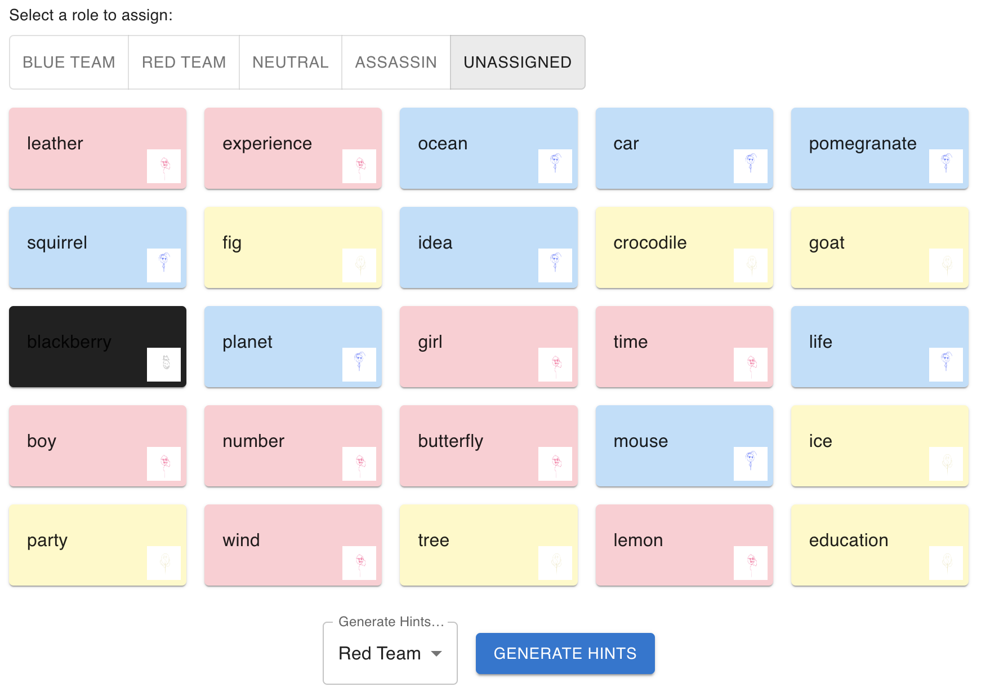

In a our lifetime, a lot of things can make us feel stupid or inadequate. Failing a test, missing the train, getting rejected from hundreds of jobs (none of these are personal experiences, of course!) - they're all devastating events, for sure. However, none of these experience can compare to the soul-crushing blow dealt to your self-worth after fumbling a clue word as the Spymaster in a game of Codenames. The blank stares from your friends, coworkers, or the group of people you've just met playing Codenames as an icebreaker game (that now think you're dumb as bricks) after stammering out a "Red 2" with 5 red-related words on the board is enough to cause irreversible damage to one's soul. When faced with problems such as these, we think back to the words of our wise ancestors: "Use an embeddings model to generate a high-dimensional semantic vector space representation of lexical units for optimal clue synthesis to win in Codenames and honour your family."

## The Learning about Word Embeddings Part

Word embeddings are dense vector representations of words in a high-dimensional space. Essentially, we're turning words into lists of numbers.

*for visual learners:*


The fundamental principle behind word embeddings is the distributional hypothesis, which posits that words appearing in similar contexts tend to have similar meanings. It's the linguistic equivalent of "you are the company you keep." The training process involves minimizing a loss function that captures the difference between the model's predictions and the actual word co-occurrences in the training data. 

A key feature of word embeddings is their ability to capture multiple degrees of similarity between words. This is achieved through the high dimensionality of the vector space. Cosine similarity is commonly used to measure the similarity between word vectors. The classic example is: vector("king") - vector("man") + vector("woman") ≈ vector("queen"). It's surprisingly intuitive and even sets me up to make jokes like this: vector("diet") + vector("minorinconvenience") - vector("willpower") ≈ vector("regret"). It's word math! I can only imagine how the "they put letters in my math!!!" people feel right now. Condolences.

Of course, despite their effectiveness, word embeddings have limitations. They struggle with polysemy, assigning a single vector to words with multiple meanings. They also require large amounts of training data and can inherit biases present in the training corpus. While our queen king example was pretty cool, the word vectors aren't always that clean and intuitive.

There are much better, mathematically intuitive explanations of word embeddings out there, so I would suggest you read one of those! 

## Codenames
Codenames is a word-guessing game where a spymaster gives one-word clues for multiple words on a grid. ([The Rules](https://czechgames.com/files/rules/codenames-rules-en.pdf)). So here's the train of thought: 

**flawless cheating method**
- Word embeddings can identify words semantically close to multiple target words.
- We can quantify relationships between all words on the board.
- This allows generating clues that connect to friendly words while avoiding opponents' words and the assassin.
 
So we're trying to turn clever clue-giving into multidimensional optimization. Because nothing says "casual party game" like vector calculus.

# Implementation
We used with "glove-wiki-gigaword-100", a model that represents word vectors in 100 dimensions. We later downgraded to "glove-twitter-25", because brevity is the soul of wit, or in my words, because using a smaller model is the soul of being able to pay rent next month.

>**Unethical Life Pro Tip!** If running a model is too expensive, just use a worse model! 

We begin the with the AI program "looking over" over the board. It starts by getting a list of candidate words - words that are somewhat related to our team's words. Then it scores each candidate based on how well it fits as a clue. The similarity is where the real magic happens:

```python
def get_similarity(word1: str, word2: str) -> float:
    if word1 in word_vectors and word2 in word_vectors:
        return word_vectors.similarity(word1, word2)
    return 0.0
```

We want a clue that's close to our words, but far from the enemy's words, and especially far from the assassin. The 5 before the assassin similarity is our way placing a restraining order on word vectors even close to the assassin word!"

All this calculation is heavy. If we did it naively, we'd be waiting ages for each clue, so it was time to optimize. We used caching, because calculating the same word similarities over and over in the same session is just wasteful . And we pruned our candidate word list aggressively. We probably don't need to consider 'syzygy' as a clue - not because it would be bad, but because yelling out "Syzygy 3" as a clue for your colleagues is social suicide. The function above just leverages GloVe embeddings to compute semantic closeness. If a word is missing from our pre-trained embedding space, we return 0. We also implemented caching for these similarity values. 

It was also at this point I decided to give this project a swanky name, **Codecracker.** (very inspired, yes I know)
## Filtering Hints: Validity and Ambiguity
Not all hints are created equal. We needed to filter out the obvious, the ambiguous, and the downright confusing. Enter the `is_valid_hint` function:

```python
def is_valid_hint(hint: str, board_words: set) -> bool:
    hint_lower = hint.lower()
    
    if hint_lower in stop_words:
        return False
    
    for word in board_words:
        word_lower = word.lower()
        if word_lower in hint_lower or hint_lower in word_lower:
            return False
    
    return True
```

This function checks if the hint is a stop word or overlaps with board words. We can't have the AI giving "dog" as a hint for "dog." (because that's just cheating!)

We also implemented an ambiguity check to avoid proper nouns:

```python
def is_ambiguous_hint(hint: str) -> bool:
    pos = pos_tag([hint])[0][1]
    return pos in ['NNP', 'NNPS']  # Filtering out proper nouns
```
## Synonym Expansion
To broaden our AI's vocabulary, we incorporated synonyms from WordNet:

```python
def get_synonyms(word: str) -> List[str]:
    synonyms = set()
    for synset in wordnet.synsets(word):
        for lemma in synset.lemmas():
            if lemma.name().isalpha():  # Only include valid words
                synonyms.add(lemma.name())
    return list(synonyms)
```

This function fetches synonyms, expanding our pool of possible hints. It's like giving our AI more resources to pull from, and hoping it doesn't become a 7th grader that discovered a thesaurus.
## Calculating Coherence: Weighted Scoring
Now for the real magic: calculating how coherent a hint is across multiple words. 

```python
def calculate_weighted_coherence(hint: str, words: List[str], weight_factor: float = 0.7) -> float:
    similarities = [get_similarity(hint, word) for word in words]
    return sum(similarities) / (len(similarities) ** weight_factor) if similarities else 0
```

This function scores a hint based on its similarity to a set of words, with a weight factor to adjust for the number of words involved. It's our way of saying, "Sure, you can connect more words, but they better make sense together."
## Strategic Hint Selection
The `find_strategic_hints` function is where it all comes together. It generates and ranks hints while trying to avoid accidentally helping the opponent or pointing to the assassin.

We even implemented an adaptive threshold:
```python
def adaptive_threshold(num_words: int) -> float:
    base_threshold = 0.4
    return base_threshold - (num_words * 0.05)
```

The more words a hint targets, the lower we set the bar. 
## Hint Caching and Optimization
Finally, we pre-filter hints and keep only the top 5 for each word group:

```python
for num_words in strategic_hints:
    strategic_hints[num_words].sort(key=lambda x: x[1], reverse=True)
    strategic_hints[num_words] = strategic_hints[num_words][:5]  # Keep top 5 hints
```

## The Front End
Like every good data scientist these days, my next task was to create a Frontend in React to actually be able to use our model! I'm not a designer (far from it, actually), so I used MaterialUI to spin something up. I just needed some basic components:
- **Game Board**: A 5x5 grid of word cards, with each card with the ability to be assigned a label
- **Team Information**: Some configuration options for which team to generate clues for
- **Clue Display**: For the clues and number of related words.



*questionable? maybe... cool? yes*


## The Cracked Codes (of varying effectiveness)
To run some initial benchmarks, I created a quick database of some example words to pull from randomly. I'll show some of the results from the clues the model generated.

**The Good Ones**
- **Shade:** Sun, Forest, Umbrella, Beach (pretty good! the words are pretty related)
- **Rack:** Coat, Suitcase, Refrigerator, Cabinet (would definitely would not be mad if my friend gave me this clue)
- **Future:** Issue, Time, Word, Job (very relevant overall!)

**The Bad Ones (there are a lot more of these)**
- **Another:** Death, Name, History, Fire (another is such a vague word!)
- **Palm:** Eagle, Farm, Salt, Coat (probably would start a fight)
- **Bring:** Bread, Watch, Way, Earth  (bring the bread?)

So these examples shows the range of the AI's clue-generating capabilities, from finding pretty intuitive connections sometimes to making associations that are difficult for human players to follow. It's certainly far from perfect, but like any other resource, I think this is a great tool for starting Spymasters off and generally mapping the terrain of the words. At its peak, it could open up some gateways for some truly godly clues, and at the worst it could probably give you a decent word to associate two words (a clue of shame).

Now, the hardest part will be stealthily pulling out your phone during a Codenames game to use Codecracker, but I'm sure we can build an AI model for that task too soon enough.

https://codecracker-seven.vercel.app/ (note: my backend is not certified yet, so you'll have to let that through first!)

**bonus:** some pictures I drew for the agents:

