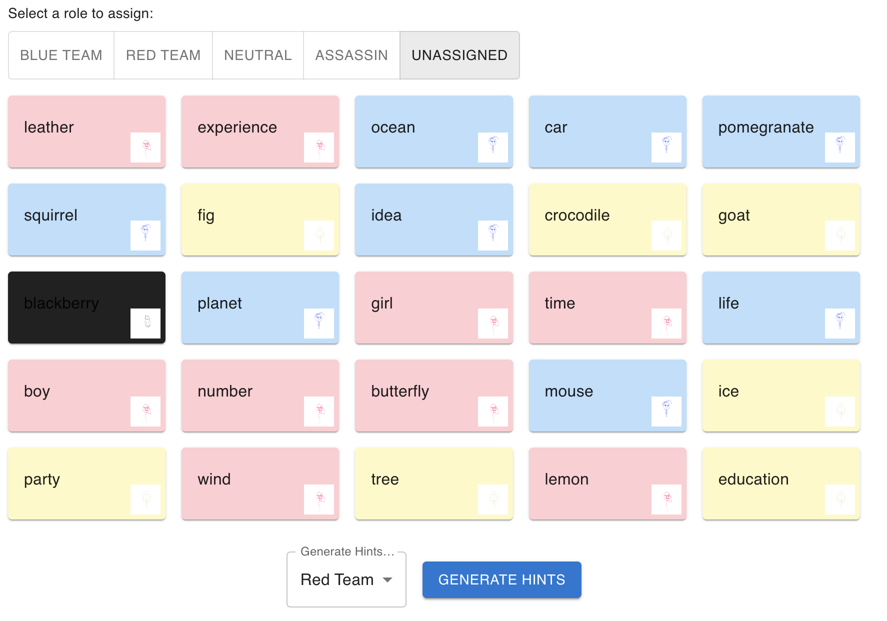
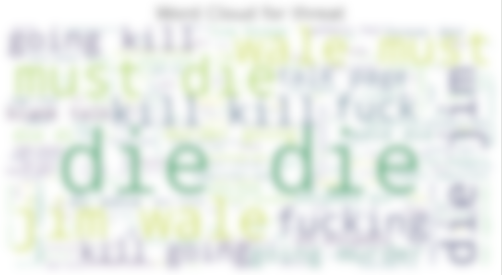
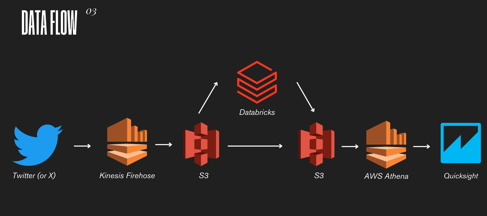
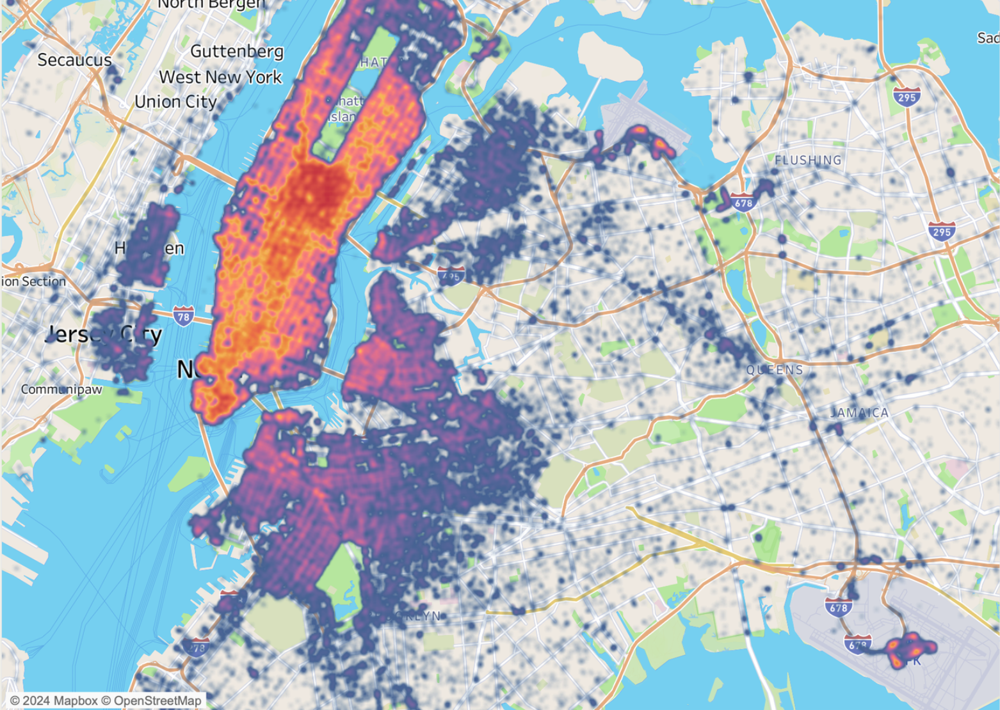

# Portfolio

## Codecracker

<figure>

<figcaption>winning not guaranteed, immunity from your friends' disappointment also not guaranteed</figcaption>
</figure>

**Codecracker** is a codenames solver that uses word embeddings to find the closest word vectors to a set of words to provide
clue words for a codemaster. It's a... little janky, but future improvements using more sophisticated approaches are planned!

Live Demo Here: [Codecracker](https://codecracker-seven.vercel.app/)

::github{repo="xpuffball/codecracker"}

---
## Toxicity Classifier

<figure>

<figcaption>blurred for your eyes</figcaption>
</figure>

**Toxicity Classifer** is a classical machine learning project that uses multiple ML and DL models to classify comments into different categories of toxicity. The dataset is available online, and it was a part of Jigsaw & Google's toxic comments classification challenge.

[Toxic Comments Classification - Slides](/jigsaw_slides.pdf)

[Toxic Comments Classification Notebook (Warning: Extreme Language as Part of the Project)](/jigsaw.pdf)

---

## Black Friday Sentiment Project (Big Data)

The **Black Friday Sentiment** project is a project that aimed to analyze general sentiment around black friday using tweets! I learnt a lot about Apache Spark, and working with big data overall! The tweet dataset I worked with had 1 million+ rows overall, and it was a lot of fun learning how to use Databricks clusters and Spark to parallelize operations. It used **AWS Athena** and **QuickSight** to pull from a S3 bucket and create a dashboard.

[Black Friday Sentiment Slides](/black_friday.pdf)

---

## Uber Ridership Visualization

The **Uber Ridership Visualization** is a project I used to get familiar and learn about **Tableau**. It uses public Uber ridership data to visualize ridership patterns in the New York City area as I try to find patterns of how people take uber rides in different weather conditions and times of week/day!

[Uber Ridership Slides](/public/uber_ridership.pdf)

---

## HobbyNet

**HobbyNet** is a full-stack web app that was built with a group of web developers! The app aimed to connect locals based on their hobbies, and was built using **React** and **PostgreSQL** primarily.
::github{repo="xpuffball/hobbynet"}
